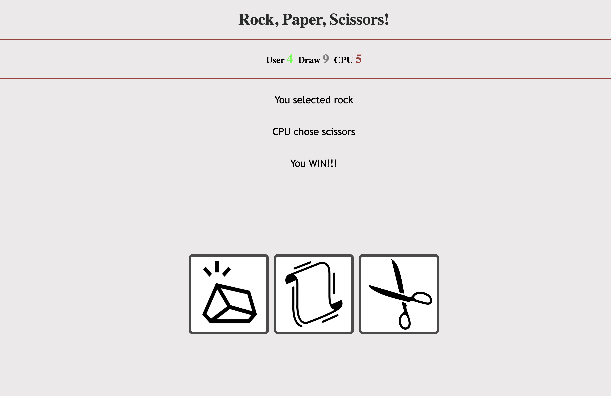

# Rock, Paper, Scissors App

This is a rock, paper, scissors game that updates the score each time one of the icons is clicked, and lets the user know who won.

# Description

This app uses eventListeners to change the score of the results whenone of the icons is clicked.

I had some difficulty with the css of this project. Placing the icons next to each other in the middle of the screen was giving me trouble, but it gave me the opportunity to learn more about classes, ID's, and divs and how they can be manipulated.

Access my project [here!](https://kurtis-casperson.github.io/rock-paper-scissors-game/)

# Author

Hey I'm Kurtis Casperson!
Connect with me! [LinkedIn](https://www.linkedin.com/in/kurtis-casperson/)
